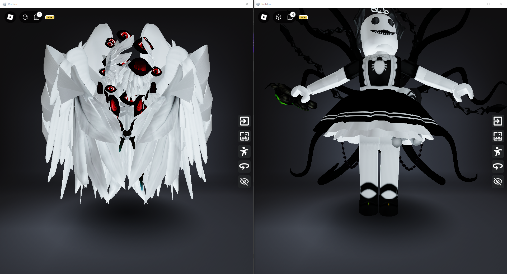
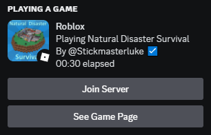

<center>

<h1>Multiblox</h1>
</center>

Multiblox is a command line Roblox bootstrapper that allows you to launch multiple instances of the game.

## Explanation

Multi-Instancing is accomplished by modifying the `roblox-player` URI protocol to point to a custom-built program. Normally, Roblox enforces a single instance restriction using a kernel object named `ROBLOX_singletonMutex`. This mutex ensures that only one instance of the game can run at a time by locking access.

Multiblox bypasses this single instance restriction by preemptively creating the mutex before the game attempts to do so. This prevents ROBLOX from performing the mutual exclusion check properly, allowing multiple instances to run concurrently.

The RobloxPlayerLauncher is the official Roblox bootstrapper responsible for ensuring the game is up to date. Due to it interrupting the hijacking process, it is removed during client installation and Multiblox assumes its responsibilities.

Multiblox creates and manages its own application directory, leaving the original Roblox application files untouched, and downloads a Roblox client in its own directory.

## Features

<center>

### Multi-Instancing

</center>

<center>

### Discord Rich Presence

</center>

## Installation

Download `MbxInstaller.exe` from the [Releases](https://github.com/Intelblox/Multiblox/releases) and run it. The installer will require admin privileges. It will set up all the files, modify the Window Registry as needed, and add the CLI to the PATH environment.

To use the `mbx` command for the first time, it will require a system restart for the newly updated PATH environment to propogate. This tool allows you to update and manage the Roblox client.

## Commands

List all commands

```console
mbx help
```

Update all

```console
mbx update
```

Update without confirmation

```console
mbx update /y
```

Update Roblox only

```console
mbx update roblox
```

Print configuration

```console
mbx config
```

Disable update notifications

```console
mbx config UpdateNotifications off
```

Uninstall Multiblox

```console
mbx uninstall
```
